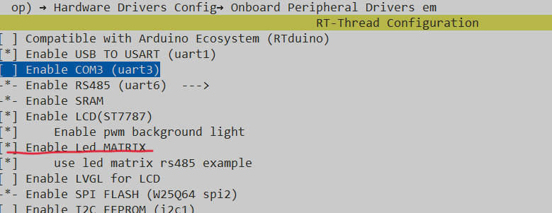

# -

# 温湿度检测

## AHT21检测温湿度
1. 硬件连接
在env中打开menuconfig打开板子上的AHT21传感器，并选择对应的i2c总线。


2.AHT21初始化
```c
aht10_device_t aht20_init(const char *i2c_bus_name)
{
    aht10_device_t dev ;


    int count=0;

    rt_thread_mdelay(1000);

    dev = aht10_init(i2c_bus_name);
    if (dev == RT_NULL)
    {
        rt_kprintf("aht10 init failed\n");
        return;
    }

    return dev;
}
```
3.AHT20读取数据
```c
        aht20.temperature = aht10_read_temperature(dev);
        aht20.humidity = aht10_read_humidity(dev);
```


## wifi自动连接
1. 硬件连接
在env中打开menuconfig打开板子上的wifi模块，并选择对应的wifi模块。


2.wifi的配置


3.wifi连接
```c
void wifi_link_nok  (void)
{
    const char *ssid = "------";
    const char *key = "----------";
    rt_thread_mdelay(1000);
    rt_wlan_scan();
    rt_wlan_connect(ssid,key);
    rt_thread_mdelay(1000);
}
```

## 蜂鸣器的使用

当我们的温度达到一定值时，需要报警来提醒我们的工作人员，这时需要使用蜂鸣器报警。

1. 硬件连接

```c
//(B-A)*16+0=16
#define PIN_BEEP        16 
```

2. 蜂鸣器的使用
```c
        if(temp > 35)
        {
            rt_pin_write(PIN_BEEP,PIN_HIGH);
        }
        else{
            rt_pin_write(PIN_BEEP,PIN_LOW);
        }
        
```
## 矩阵灯的使用
1. 硬件连接
在env中打开menuconfig打开板子上的矩阵灯，并选择对应的i2c总线。


2. 矩阵灯的使用
```c

static int led_matrix(void)
{
    int temp =0 ;

    do
    {
        aht20.temperature = aht10_read_humidity(dev);
        temp = (int)aht20.temperature;

        led_matrix_Humidity(temp);

        RGB_Reflash();

        if(temp > 35)
        {
            rt_pin_write(PIN_BEEP,PIN_HIGH);
        }
        else{
            rt_pin_write(PIN_BEEP,PIN_LOW);
        }

        rt_thread_mdelay(1000);
    } while (1);
    return 0;
}

```


## 使用文件系统来存储数据

1. 硬件连接
在env中打开menuconfig打开**File System**，并选择**FATFS**。

进入File system，选择以下两项

选择FATFS

在进入FATFS后，修改这项


2. 存储数据
```c
void open_file_save(void)
{
    rt_sprintf(String, "Temp:%.2f Humi:%.2f,count=%d",aht20.temperature,aht20.humidity,count);
    int fd = open("/fal/Data.txt", O_WRONLY | O_CREAT);

            //如果打开成功
    if (fd >= 0)
    {
            //写入文件
        write(fd, String, sizeof(String));

        rt_kprintf("Write done.\n");

            //关闭文件
        close(fd);
    }
    else
    {
        rt_kprintf("File Open Fail.\n");
    }
}
```

## LCD显示
1. 硬件连接
在env中打开menuconfig打开板子上的LCD。


2. LCD显示
```c
void lcd_display_aht21(void)
{
    rt_sprintf(string1, "temperature:%.2f",aht20.temperature);
    rt_sprintf(string2, "humidity:%.2f",aht20.humidity);
    rt_sprintf(string3, "count:%d",count);

    lcd_show_string(10,69+16+24,32,string1);
    lcd_show_string(10,69,32,string2);
    lcd_show_string(10,69-16-24,32,string3);
}
```

## mqtt上传到阿里云上进行实时监控
1. 硬件连接
在env中打开menuconfig打开板子上的mqtt。

2. mqtt配置自己的信息

3. mqtt上传数据
```c
//温度上传
static int example_publish_temperature(void *handle)
{

    char payload[50];
    rt_sprintf(payload,"{\"params\":{\"temperature\":%.1f}}",aht20.temperature);


    int             res = 0;
    const char     *fmt = "/sys/%s/%s/thing/event/property/post";
    char           *topic = NULL;
    int             topic_len = 0;


    topic_len = strlen(fmt) + strlen(DEMO_PRODUCT_KEY) + strlen(DEMO_DEVICE_NAME) + 1;
    topic = HAL_Malloc(topic_len);
    if (topic == NULL) {
        EXAMPLE_TRACE("memory not enough");
        return -1;
    }
    memset(topic, 0, topic_len);
    HAL_Snprintf(topic, topic_len, fmt, DEMO_PRODUCT_KEY, DEMO_DEVICE_NAME);

    res = IOT_MQTT_Publish_Simple(0, topic, IOTX_MQTT_QOS0, payload, strlen(payload));
    if (res < 0) {
        EXAMPLE_TRACE("publish failed, res = %d", res);
        HAL_Free(topic);
        return -1;
    }

    HAL_Free(topic);
    return 0;
}
//适度上传
static int example_publish_Humidity(void *handle)
{


    char payload[50];
    rt_sprintf(payload,"{\"params\":{\"Humidity\":%.1f}}",aht20.humidity);


    int             res = 0;
    const char     *fmt = "/sys/%s/%s/thing/event/property/post";
    char           *topic = NULL;
    int             topic_len = 0;


    topic_len = strlen(fmt) + strlen(DEMO_PRODUCT_KEY) + strlen(DEMO_DEVICE_NAME) + 1;
    topic = HAL_Malloc(topic_len);
    if (topic == NULL) {
        EXAMPLE_TRACE("memory not enough");
        return -1;
    }
    memset(topic, 0, topic_len);
    HAL_Snprintf(topic, topic_len, fmt, DEMO_PRODUCT_KEY, DEMO_DEVICE_NAME);

    res = IOT_MQTT_Publish_Simple(0, topic, IOTX_MQTT_QOS0, payload, strlen(payload));
    if (res < 0) {
        EXAMPLE_TRACE("publish failed, res = %d", res);
        HAL_Free(topic);
        return -1;
    }

    HAL_Free(topic);
    return 0;
}
```
## 主函数的运用
```c
static int work_main(void)
{
    wifi_link_nok();

    void                   *pclient = NULL;
    int                     res = 0;
    int                     loop_cnt = 0;
    iotx_mqtt_param_t       mqtt_params;


    lcd_clear(WHITE);
    lcd_set_color(WHITE,BLACK);

    HAL_GetProductKey(DEMO_PRODUCT_KEY);
    HAL_GetDeviceName(DEMO_DEVICE_NAME);
    HAL_GetDeviceSecret(DEMO_DEVICE_SECRET);

    EXAMPLE_TRACE("mqtt example");

    memset(&mqtt_params, 0x0, sizeof(mqtt_params));

    mqtt_params.handle_event.h_fp = example_event_handle;

    pclient = IOT_MQTT_Construct(&mqtt_params);
    if (NULL == pclient) {
        EXAMPLE_TRACE("MQTT construct failed");
        return -1;
    }

    res = example_subscribe(pclient);
    if (res < 0) {
        IOT_MQTT_Destroy(&pclient);
        return -1;
    }
    while (1) {
        aht20.temperature = aht10_read_temperature(dev);
        aht20.humidity = aht10_read_humidity(dev);


        if (0 == loop_cnt % 20) {
            example_publish_temperature(pclient);
            example_publish_Humidity(pclient);
        }
        IOT_MQTT_Yield(pclient, 200);

        // 显示数据
        lcd_display_aht21();
        
        // 存取数据
        open_file_save();

        loop_cnt += 1;
        count++;
        rt_thread_mdelay(1000);
    }

    return 0;
}

```


